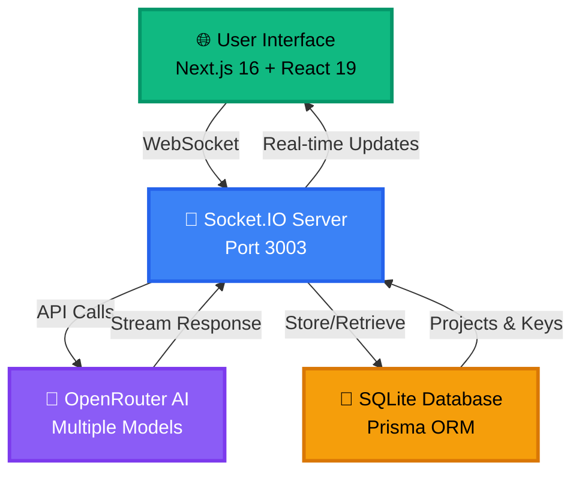
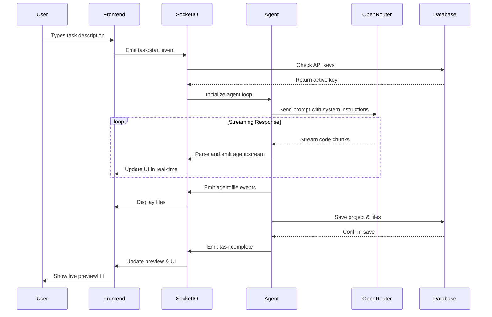

"<div align="center">

# 🧠 **Kyper Dev** - DevAgent AI


[](https://nextjs.org/)
[](https://www.typescriptlang.org/)
[](https://tailwindcss.com/)
[](https://socket.io/)
[](https://openrouter.ai/)

### *Your Personal AI Developer - Creating Full Projects Autonomously* 🎯

[🚀 Quick Start](#-quick-start) • [✨ Features](#-features) • [🏗️ Architecture](#%EF%B8%8F-architecture) • [📖 Documentation](#-how-it-works) • [⚙️ Configuration](#%EF%B8%8F-configuration)

</div>

---

## 🎬 **What is Kyper Dev?**

<div align="center">
<table>
<tr>
<td width="50%">

### 🤖 **AI-Powered Coding Agent**
An autonomous agent similar to **Devin AI** that writes complete, production-ready code based on your natural language instructions.

### 💡 **Desktop-Like Web Interface**
Beautiful, intuitive interface featuring live code preview, file management, and real-time terminal logs.

### ⚡ **Instant Prototyping**
From zero to working project in seconds. Just describe what you want, and watch the magic happen.

</td>
<td width="50%">

```javascript
// You say:
"Create a snake game with score tracking"

// Agent does:
✅ Analyzes requirements
✅ Generates HTML/CSS/JS files
✅ Creates game logic
✅ Adds scoring system
✅ Provides live preview
✅ Saves complete project

// Time taken: < 30 seconds
```

</td>
</tr>
</table>
</div>

---

## ✨ **Features**

<div align="center">

| 🎯 Feature | 📝 Description |
|-----------|---------------|
| **🤖 Autonomous Coding** | AI agent autonomously writes complete, working code from your instructions |
| **👁️ Live Preview** | Real-time iframe preview of generated HTML/CSS/JS projects |
| **📁 Smart File Management** | View, edit, and manage all generated files in an integrated code editor |
| **🔑 API Key Rotation** | Add multiple OpenRouter keys - auto-switches when rate limits hit |
| **📡 Real-Time Streaming** | Watch agent responses stream live as it codes |
| **💾 Project History** | All generated projects saved with SQLite - revisit anytime |
| **🎛️ Model Selection** | Choose your AI brain - GPT-4o, Claude, Gemini, Llama, and more |
| **🖥️ Terminal Logs** | Real-time terminal showing all agent actions and system events |
| **🔄 Context-Aware Editing** | Send existing files as context to iterate and improve projects |
| **🎨 Beautiful UI** | Modern, responsive interface built with shadcn/ui and Tailwind |

</div>

---

## 🏗️ **Architecture**

<div align="center">



</div>

### 🔧 **Tech Stack**

<table align="center">
<tr>
<td align="center" width="25%">

<br/><b>Next.js 16</b>
<br/><sub>React Framework</sub>
</td>
<td align="center" width="25%">

<br/><b>TypeScript 5</b>
<br/><sub>Type Safety</sub>
</td>
<td align="center" width="25%">

<br/><b>Socket.IO</b>
<br/><sub>Real-time Communication</sub>
</td>
<td align="center" width="25%">

<br/><b>Prisma ORM</b>
<br/><sub>Database Layer</sub>
</td>
</tr>
<tr>
<td align="center" width="25%">

<br/><b>shadcn/ui</b>
<br/><sub>UI Components</sub>
</td>
<td align="center" width="25%">

<br/><b>Tailwind CSS</b>
<br/><sub>Styling</sub>
</td>
<td align="center" width="25%">

<br/><b>Zustand</b>
<br/><sub>State Management</sub>
</td>
<td align="center" width="25%">

<br/><b>Framer Motion</b>
<br/><sub>Animations</sub>
</td>
</tr>
</table>

---

## 🚀 **Quick Start**

### ⚡ **Installation**

```bash
# Clone the repository
git clone https://github.com/yashraj-ghemud/kyper_dev.git
cd kyper_dev

# Install dependencies
bun install

# Install agent service dependencies
cd mini-services/agent-service
bun install
cd ../..

# Setup database
bun run db:push
bun run db:generate
```

### 🎯 **Start the Services**

<table>
<tr>
<td width="50%">

**Option A: Use Startup Script** 🚀
```bash
chmod +x start.sh
./start.sh
```

</td>
<td width="50%">

**Option B: Manual Start** 🔧
```bash
# Terminal 1: Agent Service
cd mini-services/agent-service
bun run dev

# Terminal 2: Frontend
bun run dev
```

</td>
</tr>
</table>

### 🌐 **Open the App**

```bash
🎉 Navigate to: http://localhost:3000
```

### 🔑 **Add Your API Keys**

1. Click the **⚙️ Settings** button
2. Add your [OpenRouter API Keys](https://openrouter.ai/settings/keys)
3. You can add multiple keys for automatic rotation! 🔄

### 💻 **Give Your First Task**

Try these examples:

<div align="center">

| 🎮 Task | ⏱️ Time |
|---------|---------|
| `"Create a snake game with score tracking"` | ~30 seconds |
| `"Build a todo app with dark theme and local storage"` | ~45 seconds |
| `"Make a calculator website with scientific functions"` | ~25 seconds |
| `"Build a weather dashboard with 5-day forecast"` | ~60 seconds |

</div>

---

## 📖 **How It Works**

<div align="center">



</div>

### 🔄 **Agent Loop Breakdown**

```typescript
1️⃣ User Input → Task description entered
2️⃣ Socket Event → task:start emitted to backend
3️⃣ API Selection → Choose active OpenRouter key
4️⃣ Prompt Engineering → System prompt + user task
5️⃣ Stream Response → AI generates code in real-time
6️⃣ Parse Output → Extract files (HTML, CSS, JS)
7️⃣ File Creation → Create and emit agent:file events
8️⃣ Database Save → Store project + files in SQLite
9️⃣ Live Preview → Render files in iframe
🔟 Task Complete → Display success + terminal logs
```

---

## ⚙️ **Configuration**

### 🧠 **Model Selection**

Choose from multiple AI models:

<div align="center">

| 🤖 Model | 🏢 Provider | 💪 Strength |
|----------|-------------|-------------|
| `neotronmon-3-ultra` | 🎯 Default | Balanced coding performance |
| `openai/gpt-4o` | 🔵 OpenAI | Best for complex logic |
| `anthropic/claude-3.5-sonnet` | 🟣 Anthropic | Best for detailed docs |
| `google/gemini-2.0-flash-001` | 🔴 Google | Fast responses |
| `meta-llama/llama-3.1-405b-instruct` | 🦙 Meta | Open-source power |

</div>

Change model in **Settings** → **Model Configuration**

### 🔑 **API Key Rotation**

**Smart Key Management:**
- ✅ Add 4-5 keys for uninterrupted service
- ✅ Auto-rotation on rate limit (429 errors)
- ✅ Manual limit reset available
- ✅ Visual indicators for active/exhausted keys

```javascript
// How rotation works:
Key 1: Active ✅ → Rate limited ❌
→ Auto-switch to Key 2: Active ✅
→ Key 1 marked as exhausted ⏱️
→ Reset all limits manually or wait for cooldown
```

---

## 📂 **Project Structure**

```
kyper_dev/
├── 📁 src/
│   ├── 📁 app/
│   │   ├── page.tsx                 # Main UI (desktop interface)
│   │   ├── layout.tsx               # Root layout
│   │   ├── globals.css              # Global styles
│   │   └── 📁 api/
│   │       └── route.ts             # API routes
│   ├── 📁 components/
│   │   ├── DiffViewer.tsx           # Code diff viewer
│   │   └── 📁 ui/                   # shadcn/ui components
│   ├── 📁 store/
│   │   └── agent-store.ts           # Zustand state management
│   ├── 📁 lib/
│   │   ├── db.ts                    # Prisma client
│   │   └── utils.ts                 # Utilities
│   └── 📁 hooks/                    # Custom React hooks
├── 📁 mini-services/
│   └── 📁 agent-service/
│       ├── index.ts                 # Socket.IO agent service
│       └── package.json             # Service dependencies
├── 📁 prisma/
│   └── schema.prisma                # Database schema
├── 📁 public/                       # Static assets
├── 📁 generated-projects/           # Saved projects
├── 📁 db/                           # SQLite database
├── package.json                     # Main dependencies
├── start.sh                         # Startup script
└── README.md                        # This file!
```

---

## 🎨 **UI Screenshots**

<div align="center">

### 💬 **Chat Interface**
> Conversational interface where you give tasks and receive real-time updates

### 📝 **Code Editor**
> View and edit all generated files with syntax highlighting

### 👁️ **Live Preview**
> Real-time iframe preview of HTML/CSS/JS projects

### 🖥️ **Terminal Logs**
> Monitor agent actions, API calls, and system events

### ⚙️ **Settings Panel**
> Manage API keys, configure models, and view statistics

</div>

---

## 🔥 **Advanced Usage**

### 🔄 **Context-Aware Editing**

```bash
# Initial creation
"Create a landing page for a coffee shop"

# Iteration with context
1. Click ➕ button next to chat input
2. Select files to include as context
3. Type: "Add a menu section with prices"
4. Agent will edit existing files! ✅
```

### 📦 **Project Management**

- **View History**: Click "Projects" tab to see all saved projects
- **Reload Project**: Click any project to load its files
- **Delete Project**: Hover and click trash icon
- **Download Files**: Copy generated code from file viewer

---

## 🤝 **Contributing**

Contributions are welcome! Here's how:

```bash
# Fork the repo
# Create your feature branch
git checkout -b feature/AmazingFeature

# Commit your changes
git commit -m 'Add some AmazingFeature'

# Push to the branch
git push origin feature/AmazingFeature

# Open a Pull Request
```

---

## 📝 **Requirements**

<div align="center">

| Requirement | Version | Purpose |
|-------------|---------|---------|
| **Node.js** | 18+ | Runtime environment |
| **Bun** | Latest | Package manager & runtime |
| **OpenRouter API Key** | N/A | AI model access |
| **Internet Connection** | N/A | API communication |

</div>

---

## 🐛 **Troubleshooting**

<details>
<summary><b>🔴 Agent Service Not Connecting</b></summary>

```bash
# Check if port 3003 is available
lsof -i :3003

# Restart agent service
cd mini-services/agent-service
bun run dev
```
</details>

<details>
<summary><b>🟡 API Key Rate Limit</b></summary>

- Add multiple API keys in Settings
- Enable automatic rotation
- Wait for cooldown (usually 1 minute)
- Manually reset limits via Settings
</details>

<details>
<summary><b>🟢 Database Issues</b></summary>

```bash
# Reset database
bun run db:reset

# Push schema
bun run db:push

# Generate client
bun run db:generate
```
</details>

---

## 📜 **License**

This project is licensed under the **MIT License** - see the [LICENSE](LICENSE) file for details.

---

## 🙏 **Acknowledgments**

<div align="center">

Built with ❤️ using amazing open-source technologies:
- [Next.js](https://nextjs.org/) - The React Framework
- [Socket.IO](https://socket.io/) - Real-time Communication
- [OpenRouter](https://openrouter.ai/) - AI Model Gateway
- [Prisma](https://www.prisma.io/) - Next-gen ORM
- [shadcn/ui](https://ui.shadcn.com/) - Beautiful Components
- [Tailwind CSS](https://tailwindcss.com/) - Utility-first CSS

Special thanks to the open-source community! 🌟

</div>

---

<div align="center">

### 🚀 **Ready to Build Something Amazing?**

[](https://github.com/yashraj-ghemud/kyper_dev)
[](https://github.com/yashraj-ghemud/kyper_dev/fork)
[](https://github.com/yashraj-ghemud/kyper_dev)

### Made with 💚 by Yashraj Ghemud

[🌐 Website](https://kyper.dev) • [📧 Email](mailto:contact@kyper.dev) • [🐦 Twitter](https://twitter.com/yashrajghemud)

---


</div>" 
